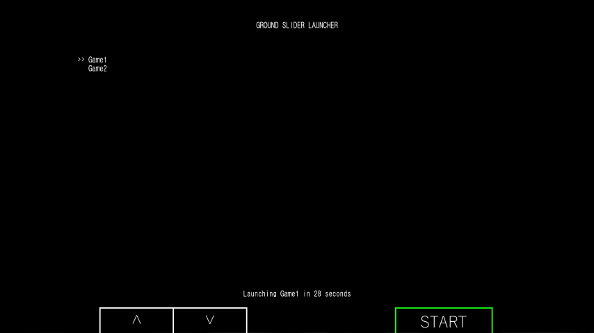
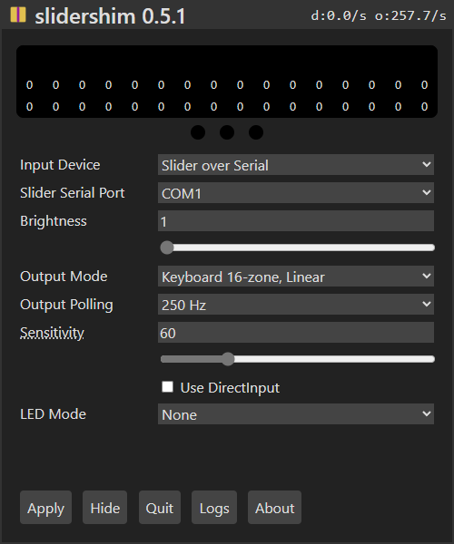

# SliderLaunch

Select and launch a list of games from an ini file with your controller of choice. Works with all devices supported by slidershim.

# Requirements
- [Python 3.13](https://www.python.org/downloads/)
- [PyGame](https://www.pygame.org/wiki/GettingStarted#Pygame%20Installation)
- [PyWin32api](https://pypi.org/project/pywin32/)
- [slidershim](https://github.com/4yn/slidershim)

# Slidershim Setup
Slidershim should be installed to `C:\Program Files\slidershim` if you used the MSI installer, or you can edit the slidershim path in the python code.

  
Change "Input Device" to the controller that you are using and change "Output Mode" to "Keyboard 16-zone, Linear"
